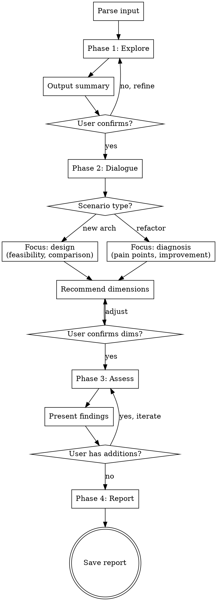

# arch-brain Skill Implementation Plan

> **For agentic workers:** REQUIRED: Use superpowers:subagent-driven-development (if subagents available) or superpowers:executing-plans to implement this plan. Steps use checkbox (`- [ ]`) syntax for tracking.

**Goal:** Create the arch-brain Claude Code skill — a senior software architect that performs architecture review, refactoring analysis, and design evaluation with structured multi-dimensional assessment reports.

**Architecture:** Single skill with two files: SKILL.md (flow, dimensions, logic) and report-template.md (output template). Installed to `~/.claude/skills/arch-brain/`. The skill guides Claude through a four-phase interactive process (explore → dialogue → assess → report) and outputs a structured evaluation document.

**Tech Stack:** Markdown skill files for Claude Code, no code dependencies.

**Spec:** `docs/superpowers/specs/2026-03-17-arch-brain-design.md`

---

### Task 1: Create report-template.md

The report template is a dependency for SKILL.md (referenced in Phase 4). Create it first.

**Files:**
- Create: `~/.claude/skills/arch-brain/report-template.md`

- [ ] **Step 1: Create the skills directory**

```bash
mkdir -p ~/.claude/skills/arch-brain
```

- [ ] **Step 2: Write report-template.md**

Create `~/.claude/skills/arch-brain/report-template.md` with the following exact content:

```markdown
# Report Template

Use this template when generating the final architecture evaluation report in Phase 4.

## Template

```markdown
# [项目名称] 架构评估报告

**日期:** YYYY-MM-DD
**评估类型:** 新架构设计 / 重构分析
**评估范围:** [简述]

---

## 1. 执行摘要

[一段话总结关键发现和核心建议，供决策者快速阅读]

## 2. 现状分析

### 技术栈概览
[当前使用的语言、框架、中间件、基础设施]

### 架构现状
[组件关系、模块边界、数据流、部署模型]

### 已识别的问题和风险
- [问题 1]
- [问题 2]

## 3. 核心维度评估

| 维度 | 评分(1-10) | 当前状态 | 关键发现 |
|------|-----------|---------|---------|
| [维度名] | [分数] | [优/良/中/差] | [一句话发现] |

**评分校准:** 1-3 = 严重不足, 4-5 = 低于行业平均, 6 = 行业平均, 7-8 = 良好, 9-10 = 优秀

### 3.1 [维度名] 详细分析

**现状描述:** [当前状态的客观描述]

**问题与风险:**
- [具体问题及其影响]

**改进建议:**
- [具体可操作的建议]

[每个核心维度重复此子节]

## 4. 辅助维度评估

| 维度 | 风险等级(高/中/低) | 说明 |
|------|-------------------|------|
| [维度名] | [等级] | [简要说明] |

## 5. 架构建议方案

### 方案 A: [名称]（推荐）
- **描述:** [方案概述]
- **优势:** [列出优势]
- **劣势:** [列出劣势]
- **预估投入:** [人力、时间、基础设施成本]

### 方案 B: [名称]
- **描述:** [方案概述]
- **优势:** [列出优势]
- **劣势:** [列出劣势]
- **预估投入:** [人力、时间、基础设施成本]

## 6. 实施路线图

### 短期 (1-4 周)
- [优先级最高的改进项]

### 中期 (1-3 月)
- [核心架构改进]

### 长期 (3-6 月)
- [战略性架构演进]

### 风险缓解措施
- [关键风险及其缓解方案]

## 7. 总结与决策建议

**推荐方案:** [方案名] — [一句话理由]

**关键决策点:**
- [需要决策者拍板的事项]

**下一步行动项:**
- [ ] [具体行动 1]
- [ ] [具体行动 2]
```

## Usage Notes

- Replace all `[placeholder]` text with actual analysis content
- Core dimension sub-sections (3.1, 3.2, etc.) should only be created for dimensions selected in Phase 3
- Auxiliary dimensions table only includes dimensions confirmed by user
- Architecture proposals: always provide at least 2 options, recommend one
- Roadmap phases can be adjusted based on project urgency
- When no codebase path was provided, save report to CWD: `./docs/arch-brain/reports/YYYY-MM-DD-<topic>.md`
```

- [ ] **Step 3: Verify file was created correctly**

```bash
test -f ~/.claude/skills/arch-brain/report-template.md && echo "OK" || echo "MISSING"
wc -l ~/.claude/skills/arch-brain/report-template.md
```

Expected: OK, ~90 lines

- [ ] **Step 4: Commit**

```bash
cd /root/arch-brain
git add -A
git commit -m "feat: add arch-brain report template"
```

---

### Task 2: Create SKILL.md

The main skill file containing flow definition, phase instructions, dimension library, and control logic.

**Files:**
- Create: `~/.claude/skills/arch-brain/SKILL.md`

- [ ] **Step 1: Write SKILL.md**

Create `~/.claude/skills/arch-brain/SKILL.md` with the following exact content:

```markdown
---
name: arch-brain
description: Use when manually invoked to perform architecture review, refactoring analysis, or architecture design evaluation for software projects — covers both new system design and existing system restructuring
---

# arch-brain

## Overview

Senior software architect skill for architecture review, refactoring analysis, and design evaluation. Produces structured multi-dimensional assessment reports with quantified scores and actionable recommendations.

**Core principle:** Understand before evaluating. Never assess without completing exploration and dialogue phases first.

## When to Use

- Manual invocation via `/arch-brain`
- Architecture review for new system designs
- Refactoring analysis for existing systems
- Architecture decision evaluation with ROI analysis
- Multi-dimensional quality attribute assessment

## Input Handling

Parse arguments passed to `/arch-brain`:

| Input | Detection | Action |
|-------|-----------|--------|
| Directory path | Path exists and is directory | Explore codebase structure, deps, tech stack |
| File path | Path exists and is file | Read document, extract architecture elements |
| Path + text | Path exists, followed by description | Explore code, then align with stated intent |
| No arguments | Empty args | Dialogue-guided: ask user to describe project |

When input is a codebase path, use the Explore agent for thorough analysis of: directory structure, dependency files (package.json, go.mod, requirements.txt, pom.xml, etc.), core modules, entry points, config files, and CI/CD setup.

## The Four Phases

You MUST complete each phase before proceeding to the next.



### Phase 1: Explore & Understand

**Goal:** Build accurate mental model of the system.

**For codebases:** Use Explore agent or direct tools to analyze:
- Directory structure and module organization
- Dependencies and tech stack
- Core components and their relationships
- Entry points, APIs, data flow
- Build/deploy configuration
- Code scale (LOC, file count, module count)

**For architecture documents:** Extract:
- Components and interfaces
- Data flow and integration points
- Deployment model
- Stated constraints and requirements

**For no-input mode:** Ask the user to describe:
- What the system does (business context)
- Current tech stack
- Scale (users, data volume, team size)
- What prompted this review

**Phase 1 exit:** Present a "Current State Summary" and ask the user to confirm accuracy. If inaccurate, gather corrections and re-summarize.

### Phase 2: Architecture Dialogue

**Goal:** Understand objectives, constraints, and pain points through one-question-at-a-time conversation.

**Topics to cover:**
1. **Goals & constraints** — Business objectives, technical constraints, team size, timeline
2. **Pain points** — Biggest architecture pain points, most concerning quality attributes
3. **Scenario identification** — Determine: new architecture design OR refactoring optimization
   - **New architecture** → Focus on feasibility analysis, option comparison, trade-offs
   - **Refactoring** → Focus on problem diagnosis, root cause analysis, improvement paths
   - **Hybrid** (both new + refactor) → Ask user which aspect to prioritize, or split analysis

**Phase 2 exit:** Recommend evaluation dimensions (see Dimension Library) and ask user to confirm. User can add or remove dimensions.

### Phase 3: Assessment

**Goal:** Evaluate each confirmed dimension with evidence-based analysis.

For each **core dimension**: analyze against the project context and assign a 1-10 score.

**Score calibration:**
- 1-3: Severe deficiency, immediate risk
- 4-5: Below industry average, needs attention
- 6: Industry average, acceptable
- 7-8: Good, above average
- 9-10: Excellent, best-in-class

For each **auxiliary dimension**: assign High/Medium/Low risk rating with brief explanation.

**For new architecture scenarios**, also:
- Compare 2-3 architecture options
- Evaluate trade-offs between options
- Recommend preferred option with justification

**For refactoring scenarios**, also:
- Identify root causes of current issues
- Prioritize improvements by impact/effort ratio
- Propose incremental migration path

**Phase 3 exit:** Present preliminary findings. User can request additional analysis or corrections. Iterate until user is satisfied.

### Phase 4: Generate Report

**Goal:** Produce structured evaluation document.

1. Read `report-template.md` from this skill directory
2. Fill template with all analysis from Phases 1-3
3. Save to project directory: `docs/arch-brain/reports/YYYY-MM-DD-<topic>.md`
   - If no project directory context, save to CWD
4. Present the saved path to user

## Dimension Library

### Core Dimensions (1-10 score)

| Dimension | Assessment Focus | Typical Applicability |
|-----------|-----------------|----------------------|
| Performance | Response time, throughput, resource utilization, bottleneck analysis | Almost all projects |
| Security | Attack surface, auth, data protection, compliance | User data, network exposure |
| Scalability | Horizontal/vertical scaling, elasticity, stateless design | High-growth, distributed systems |
| Maintainability | Code readability, module coupling, change cost | Long-lifecycle projects |
| Cost | Dev effort, migration cost, learning curve, infrastructure | Major changes |
| ROI | Business value, tech debt reduction, efficiency gains | Justifying investment |

### Auxiliary Dimensions (High/Medium/Low risk)

| Dimension | When to Include |
|-----------|----------------|
| Testability | Test coverage difficult, legacy systems |
| Observability | Distributed systems, microservices, production debugging |
| Team Cognitive Load | Large teams, multi-team collaboration, many newcomers |
| Tech Debt | Refactoring projects, legacy systems |
| Migration Risk | Architecture migration, tech stack switch |
| Data Consistency | Distributed data, multiple data sources |
| Availability/DR | High-availability requirements, critical business systems |
| Deployment Complexity | CI/CD, multi-environment, containerization |

### Dimension Selection

After Phase 2, recommend dimensions based on project characteristics:

> "Based on your project characteristics ([characteristics]), I recommend evaluating: [Core] performance, scalability, maintainability, cost, ROI [Auxiliary] tech debt, migration risk, observability. Want to adjust?"

## Common Mistakes

| Mistake | Correction |
|---------|-----------|
| Jumping to assessment without understanding | Complete Phase 1 and 2 first — always |
| Evaluating all dimensions regardless of relevance | Select dimensions based on project type, confirm with user |
| Giving vague recommendations | Every recommendation must be specific and actionable |
| Scores without justification | Every score needs evidence from the analysis |
| Single architecture option | Always provide at least 2 options with trade-offs |
| Ignoring implementation feasibility | Cost and team capacity must factor into recommendations |
```

- [ ] **Step 2: Verify file was created and check word count**

```bash
test -f ~/.claude/skills/arch-brain/SKILL.md && echo "OK" || echo "MISSING"
wc -w ~/.claude/skills/arch-brain/SKILL.md
```

Expected: OK, ~800-1000 words (within recommended range for technique skills)

- [ ] **Step 3: Verify YAML frontmatter is valid**

```bash
head -4 ~/.claude/skills/arch-brain/SKILL.md
```

Expected:
```
---
name: arch-brain
description: Use when manually invoked to perform architecture review, refactoring analysis, or architecture design evaluation for software projects — covers both new system design and existing system restructuring
---
```

- [ ] **Step 4: Commit**

```bash
cd /root/arch-brain
git add -A
git commit -m "feat: add arch-brain SKILL.md — architecture review and evaluation skill"
```

---

### Task 3: Verify skill discovery

Confirm Claude Code can discover and load the skill.

**Files:**
- Read: `~/.claude/skills/arch-brain/SKILL.md`
- Read: `~/.claude/skills/arch-brain/report-template.md`

- [ ] **Step 1: Verify directory structure**

```bash
find ~/.claude/skills/arch-brain/ -type f | sort
```

Expected:
```
/root/.claude/skills/arch-brain/SKILL.md
/root/.claude/skills/arch-brain/report-template.md
```

- [ ] **Step 2: Verify skill name and description format**

```bash
head -4 ~/.claude/skills/arch-brain/SKILL.md
```

Verify:
- `name:` uses only letters, numbers, hyphens
- `description:` starts with "Use when"
- Total frontmatter under 1024 characters

- [ ] **Step 3: Verify report template is referenced correctly in SKILL.md**

```bash
grep -n "report-template.md" ~/.claude/skills/arch-brain/SKILL.md
```

Expected: At least one match in Phase 4 section (e.g., "Read `report-template.md` from this skill directory")

- [ ] **Step 4: Final commit with both files**

```bash
cd /root/arch-brain
git status
git log --oneline
```

Verify: clean working tree, two feature commits present.
