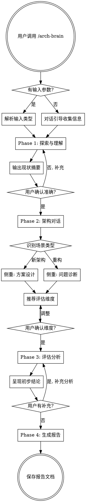

# arch-brain Skill Design Spec

## Overview

arch-brain 是一个充当资深软件架构师角色的 Claude Code skill，用于软件架构评审、重构分析和架构方案设计。它通过交互式对话理解项目现状和目标，然后输出包含多维度量化评估的结构化架构评估报告。

## Skill 元信息

```yaml
name: arch-brain
description: Use when manually invoked to perform architecture review, refactoring analysis, or architecture design evaluation for software projects — covers both new system design and existing system restructuring
```

- **触发方式**：手动调用 `/arch-brain`
- **Skill 类型**：Technique（流程型）
- **安装位置**：`~/.claude/skills/arch-brain/`

## 输入支持

用户调用时可选传入参数：

| 输入类型 | 示例 | 处理方式 |
|---------|------|---------|
| 代码库路径 | `/arch-brain ./src` | 分析目录结构、依赖、模块、技术栈、代码规模 |
| 架构文档路径 | `/arch-brain docs/architecture.md` | 读取文档，提取架构要素 |
| 代码库 + 意图描述 | `/arch-brain ./src 想拆成微服务` | 先分析现状，再结合意图识别差距 |
| 无参数 | `/arch-brain` | 对话引导用户提供项目背景和目标 |

## 核心流程

四阶段流程，每阶段结束有用户确认节点：

```
Phase 1: 探索与理解 → Phase 2: 架构对话 → Phase 3: 评估分析 → Phase 4: 输出报告
```

### Phase 1: 探索与理解

根据输入类型自动选择探索策略：

| 输入类型 | 探索动作 |
|---------|---------|
| 代码库路径 | 分析目录结构、依赖关系、核心模块、技术栈、代码规模 |
| 架构文档 | 读取文档，提取架构要素（组件、接口、数据流、部署模型） |
| 代码库 + 意图 | 先分析代码现状，再结合用户意图识别差距 |
| 无输入 | 通过对话引导用户描述项目背景和目标 |

探索完成后输出"现状理解摘要"，请用户确认准确性。不准确则补充后重新探索。

### Phase 2: 架构对话

一问一答式深入理解：

- **目标与约束**：业务目标、技术约束、团队规模、时间窗口
- **痛点与关注**：当前最大的架构痛点、最关心哪些质量属性
- **场景识别**：自动判断属于"新架构设计"还是"重构优化"
  - **新架构** → 侧重方案设计（关注可行性、方案对比）
  - **重构** → 侧重问题诊断（关注痛点、改进路径）

### Phase 3: 评估分析

根据项目特征动态选择评估维度（见下文"评估维度"章节），向用户确认后逐维度分析。完成后呈现初步结论，用户可补充后迭代。

### Phase 4: 输出报告

生成结构化评估文档，保存到 `docs/arch-brain/reports/YYYY-MM-DD-<topic>.md`。

## 流程图



## 评估维度

### 维度库

不使用固定维度列表，根据项目特征从维度库中动态选择。

**核心维度**（高频出现，1-10 评分）：

| 维度 | 评估要点 | 典型适用场景 |
|------|---------|------------|
| 性能 | 响应时间、吞吐量、资源利用率、瓶颈分析 | 几乎所有项目 |
| 安全性 | 攻击面、认证授权、数据保护、合规性 | 涉及用户数据、网络暴露 |
| 可扩展性 | 水平/垂直扩展能力、弹性、无状态设计 | 高增长、分布式系统 |
| 可维护性 | 代码可读性、模块耦合度、变更成本 | 长生命周期项目 |
| 投入成本 | 开发人力、迁移成本、学习曲线、基础设施成本 | 涉及重大变更 |
| 收益分析 | 业务价值、技术债务减少、效率提升 | 需要论证 ROI |

**辅助维度**（按需选择，高/中/低 定性评级）：

| 维度 | 适用条件 |
|------|---------|
| 可测试性 | 测试覆盖困难、遗留系统 |
| 可观测性 | 分布式系统、微服务、生产调试需求 |
| 团队认知负荷 | 大团队、多团队协作、新人多 |
| 技术债务 | 重构项目、遗留系统 |
| 迁移风险 | 架构迁移、技术栈切换 |
| 数据一致性 | 分布式数据、多数据源 |
| 可用性/容灾 | 高可用要求、关键业务系统 |
| 部署复杂度 | CI/CD、多环境、容器化 |

### 选择逻辑

Phase 2 对话结束后，根据项目特征自动推荐维度组合并向用户确认，用户可增减维度。

## 报告模板

```markdown
# [项目名称] 架构评估报告

**日期:** YYYY-MM-DD
**评估类型:** 新架构设计 / 重构分析
**评估范围:** [简述]

---

## 1. 执行摘要
一段话总结关键发现和核心建议（供决策者快速阅读）

## 2. 现状分析
- 技术栈概览
- 架构现状（组件图/模块关系）
- 已识别的问题和风险

## 3. 核心维度评估

| 维度 | 评分(1-10) | 当前状态 | 关键发现 |
|------|-----------|---------|---------|
| ... | ... | ... | ... |

### 3.N [维度名] 详细分析
- 现状描述
- 问题与风险
- 改进建议

## 4. 辅助维度评估

| 维度 | 风险等级 | 说明 |
|------|---------|------|
| ... | ... | ... |

## 5. 架构建议方案
### 方案 A: [名称]（推荐）
- 描述
- 优势 / 劣势
- 预估投入

### 方案 B: [名称]
- 描述
- 优势 / 劣势
- 预估投入

## 6. 实施路线图
- 阶段划分（短期/中期/长期）
- 优先级排序
- 关键里程碑
- 风险缓解措施

## 7. 总结与决策建议
- 推荐方案及理由
- 关键决策点
- 下一步行动项
```

## 文件结构

```
~/.claude/skills/arch-brain/
  SKILL.md              # 主文件：流程定义、阶段说明、分支逻辑、维度库
  report-template.md    # 报告模板（Phase 4 引用）
```

报告输出到被分析项目目录下：`docs/arch-brain/reports/YYYY-MM-DD-<topic>.md`

## 设计决策

1. **单 skill 方案**：新架构评审和重构分析共享大部分流程，仅在分析侧重点有差异，不需要拆分
2. **维度动态选择**：避免对所有项目千篇一律，根据特征推荐 + 用户确认
3. **混合量化**：核心维度评分制提供可比较性，辅助维度定性分析避免虚假精确
4. **每阶段用户确认**：避免分析方向偏离，保证输出有价值
5. **报告模板独立文件**：保持 SKILL.md 聚焦于流程逻辑，模板作为重量级参考单独存放
