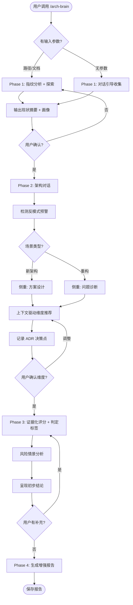

# arch-brain Skill 设计规格（完整版）

> 本文档为 arch-brain skill 的完整设计规格，从零构建。实施时需先保存为 `docs/superpowers/specs/2026-03-17-arch-brain-v2-design.md`，替代原有 v1 设计规格，再创建实施计划。

## Context

arch-brain 是一个 Claude Code skill，充当资深软件架构师角色。当前项目仅有设计文档和实施计划，skill 文件（SKILL.md、report-template.md）尚未创建。本规格为从零开始的完整设计，融合了原始 v1 流程与全面优化（智能上下文感知、架构模式库、证据化评分、风险情景分析、顾问风格、可视化、ADR 生成）。

**核心设计目标：**
- **用户画像**：面向重大架构决策场景（系统重构、技术选型、新系统设计）
- **架构师风格**：观点鲜明的顾问——敢于说"不应该"和"必须"
- **杀手级功能**：智能上下文感知——根据项目特征自动调整评审重点和深度

## Skill 元信息

```yaml
name: arch-brain
description: Use when manually invoked to perform architecture review, refactoring analysis, or architecture design evaluation for software projects — covers both new system design and existing system restructuring
```

- **触发方式**：手动调用 `/arch-brain`
- **安装位置**：`~/.claude/skills/arch-brain/`
- **文件结构**：`SKILL.md`（主文件）+ `report-template.md`（报告模板）
- **SKILL.md 目标字数**：1200-1500 词（含表格，确保不挤占分析上下文）

## 输入支持

| 输入类型 | 示例 | 处理方式 |
|---------|------|---------|
| 代码库路径 | `/arch-brain ./src` | 执行项目指纹分析，生成画像 |
| 架构文档路径 | `/arch-brain docs/architecture.md` | 读取文档，提取架构要素 |
| 代码库 + 意图描述 | `/arch-brain ./src 想拆成微服务` | 指纹分析 + 结合意图识别差距 |
| 无参数 | `/arch-brain` | 对话引导模式（跳过指纹引擎，直接进入对话） |

---

## 一、项目指纹引擎

当用户提供代码库路径时，Phase 1 自动执行项目指纹分析。**无参数调用时跳过指纹引擎，直接通过对话收集项目信息。**

### 信号采集策略（按优先级）

**优先级 1 — 项目自述文件（最高质量信号）：**

| 文件 | 提取信息 |
|------|---------|
| `CLAUDE.md` / `AGENTS.md` | 项目约束、工作流规范、架构决策、团队协作模式 |
| `README.md` | 项目目标、技术栈、架构概述、功能范围 |
| `ARCHITECTURE.md`、`docs/` 下架构文档 | 架构设计意图、组件关系、设计决策 |

**优先级 2 — 技术元数据（补充验证）：**

| 信号类型 | 采集来源 | 推断信息 |
|----------|---------|---------|
| 依赖文件 | package.json, go.mod, requirements.txt, pom.xml | 技术栈、框架选型、依赖复杂度 |
| 目录结构 | 目录命名模式 | 架构风格（分层/DDD/模块化） |
| 配置文件 | Dockerfile, k8s yaml, terraform, CI 配置 | 部署模式、基础设施复杂度 |
| 代码统计 | 文件数量、代码行数、语言分布 | 项目规模 |
| Git 信息 | 贡献者数量、提交频率 | 团队规模、协作模式 |

### 指纹输出格式

```
项目画像:
  技术栈: [自动识别]
  架构风格: [自动识别]
  项目规模: 小型(<10K LOC) / 中型(10-100K) / 大型(100K-1M) / 巨型(>1M)
  部署模式: [自动识别]
  团队特征: [从 CLAUDE.md/AGENTS.md 提取]
  关键特征: [标签列表]
```

---

## 二、架构模式库

内置于 SKILL.md 中的精简架构知识表。

### 架构模式（用于识别和对比）

| 模式 | 特征信号 | 适用场景 |
|------|---------|---------|
| 分层架构 | controllers/services/repositories 目录分层 | 大多数 Web 应用 |
| 微服务 | 多个独立部署单元、服务间通信、API 网关 | 大规模、多团队 |
| 六边形架构 | ports/adapters 分离、核心领域不依赖外部 | 复杂业务逻辑 |
| CQRS | 读写分离、命令/查询独立处理 | 高并发读写分离需求 |
| 事件驱动 | 消息队列、事件总线、发布订阅模式 | 异步处理、解耦系统 |
| Serverless | 函数即服务、按需触发 | 低流量、事件驱动负载 |
| 模块化单体 | 单一部署单元但内部模块边界清晰 | 中型项目、早期阶段 |

### 反模式（用于主动检测和预警）

| 反模式 | 特征信号 | 风险 |
|--------|---------|------|
| 泥球架构 | 无清晰模块边界、高耦合、改动波及全局 | 维护成本指数增长 |
| 分布式单体 | 微服务部署但共享数据库、同步调用链 | 同时承受分布式和单体的劣势 |
| 过早微服务化 | 小团队/早期项目就拆微服务 | 运维复杂度远超收益 |
| 上帝类/模块 | 单一模块承担过多职责 | 测试困难、变更风险高 |
| 循环依赖 | 模块间双向依赖 | 无法独立部署和测试 |

### 演进路径（用于重构建议）

| 起点 | 目标 | 关键步骤 |
|------|------|---------|
| 单体 | 模块化单体 | 识别边界、提取模块、定义接口 |
| 模块化单体 | 微服务 | 独立数据库、API 网关、服务发现 |
| 同步架构 | 事件驱动 | 引入消息队列、事件溯源、最终一致性 |

---

## 三、证据化评分体系

### 通用评分标准框架

| 分档 | 分数范围 | 含义 |
|------|---------|------|
| 差 | 1-3 | 严重不足，存在即时风险 |
| 中等 | 4-6 | 低于或达到行业平均，需关注 |
| 良好 | 7-8 | 高于行业平均，仍有优化空间 |
| 优秀 | 9-10 | 业内领先，可作为标杆 |

### 各核心维度评分标准

**性能：**

| 分数 | 具体标准 |
|------|---------|
| 1-3 | P99 响应 >5s、频繁超时、资源利用率 >90%、无性能监控 |
| 4-6 | P99 响应 1-5s、偶发瓶颈、基本的性能监控 |
| 7-8 | P99 响应 <500ms、有性能优化策略、持续监控和告警 |
| 9-10 | P99 响应 <100ms、系统性的性能工程、预测性扩容 |

**安全性：**

| 分数 | 具体标准 |
|------|---------|
| 1-3 | 已知漏洞未修复、明文存储敏感数据、无认证/授权机制 |
| 4-6 | 基本认证但存在缺陷、部分合规、安全更新滞后 |
| 7-8 | 完整的认证授权、加密传输和存储、定期安全审计 |
| 9-10 | 零信任架构、自动化安全扫描、合规认证齐全、安全设计内置 |

**可扩展性：**

| 分数 | 具体标准 |
|------|---------|
| 1-3 | 垂直扩展已到极限、有状态设计阻碍水平扩展、单点瓶颈 |
| 4-6 | 可有限水平扩展、部分无状态、扩展需手动干预 |
| 7-8 | 水平扩展良好、无状态设计、自动扩缩容 |
| 9-10 | 弹性伸缩、多区域部署、线性扩展能力、容量规划完善 |

**可维护性：**

| 分数 | 具体标准 |
|------|---------|
| 1-3 | 高耦合、无模块边界、改一处动全身、新人上手需数月 |
| 4-6 | 有一定模块化但边界模糊、部分区域改动成本高 |
| 7-8 | 清晰的模块边界、改动影响可控、新人可在数周内贡献 |
| 9-10 | 高内聚低耦合、变更隔离良好、文档完善、认知负荷低 |

**投入成本：**

| 分数 | 具体标准 |
|------|---------|
| 1-3 | 成本远超预算、需大量专业人才市场稀缺、基础设施成本失控 |
| 4-6 | 成本偏高但可承受、需要培训投入、有隐性成本未计 |
| 7-8 | 成本合理可控、团队有能力交付、基础设施成本优化 |
| 9-10 | 高成本效益比、充分利用已有资源、投入可预测 |

**收益分析：**

| 分数 | 具体标准 |
|------|---------|
| 1-3 | 收益不明确、无法量化、投入产出比 <1 |
| 4-6 | 有一定收益但难以量化、投入产出比接近 1 |
| 7-8 | 收益明确可量化、投入产出比 >2、技术债显著减少 |
| 9-10 | 收益远超投入、战略性竞争优势、长期复合回报 |

### 架构师判定标签

每个评估维度必须给出明确判定：

- **✅ 健康** — 无需特别关注（分数 7+）
- **⚠️ 关注** — 存在隐患，建议纳入规划（分数 4-6）
- **🚨 必须改进** — 阻碍系统发展，需立即行动（分数 1-3）

---

## 四、风险情景分析

Phase 3 评估完维度后，根据项目指纹自动选择 2-3 个最相关的情景进行 What-If 推演。

### 标准情景集

| 情景 | 分析问题 | 适用条件 |
|------|---------|---------|
| 流量压力 | 如果流量增长 10x，哪里先崩？ | 有用户流量的系统 |
| 故障传播 | 核心服务 X 宕机，影响范围多大？ | 分布式系统、微服务 |
| 技术债累积 | 维持现状 12 个月，最大风险？ | 重构项目 |
| 团队变动 | 核心开发者离职，哪些模块最脆弱？ | 知识集中、文档不全 |
| 技术过期 | 核心依赖停止维护或有安全漏洞？ | 依赖老旧框架/库 |

### 情景输出格式

```
风险情景 #N: [情景名]
  薄弱环节: [具体位置/组件]
  影响评估: [量化或定性描述影响程度]
  建议措施: [具体可操作的应对方案]
  优先级: ✅低 / ⚠️中 / 🚨高
```

---

## 五、架构师顾问风格

贯穿全流程的风格定义。

### 风格原则

1. **先理解，后判断**：Phase 1-2 保持开放和好奇，Phase 3-4 给出鲜明观点
2. **敢于说不**：如果方案有明显缺陷，直接指出而非委婉暗示
3. **给出理由**：每个强观点都伴随具体理由和证据
4. **区分"建议"和"必须"**：用明确措辞区分优先级

### 语言模式示例

```
❌ "可以考虑引入缓存层来优化性能"
✅ "**必须**引入缓存层。当前数据库查询响应 P99 已达 2s，
    在流量增长 3x 后将直接导致服务不可用。建议优先引入
    Redis 读缓存，预计可将 P99 降至 200ms 以内。"

❌ "微服务架构可能不太适合当前阶段"
✅ "**不建议**在当前阶段拆分微服务。团队仅 4 人，
    微服务的运维成本将吞噬 60%+ 的开发带宽。
    建议先走模块化单体，在团队扩大到 15 人以上时再评估拆分。"
```

---

## 六、架构可视化

Phase 4 报告中生成 Mermaid 图辅助架构分析。

### 图类型选择策略

| 分析场景 | Mermaid 图类型 | 用途 |
|---------|---------------|------|
| 模块关系分析 | flowchart | 展示模块间依赖和通信 |
| 系统部署分析 | flowchart | 展示基础设施和部署拓扑 |
| 关键流程分析 | sequenceDiagram | 展示核心业务流程调用链 |
| 方案对比 | 两个独立 flowchart | 现状 vs 目标架构 |

**约束**：每张图不超过 15 个节点，报告中 1-2 张图（根据分析内容选择最有价值的类型）。

---

## 七、ADR 生成

在评审中识别架构决策点，在报告附录中生成 ADR。

### 触发规则

- **默认行为**：Phase 2/3 中记录潜在决策点，Phase 4 报告附录中列出 ADR
- **独立文件**：仅在用户明确要求时生成独立 ADR 文件到 `docs/arch-brain/adrs/`
- **编号规则**：如果 `docs/arch-brain/adrs/` 已存在，从最大编号 +1 开始；否则从 001 开始

### ADR 格式

```markdown
# ADR-NNN: [决策标题]

**状态:** 建议
**日期:** YYYY-MM-DD

## 上下文
[为什么需要做这个决策]

## 决策
[具体的架构决策内容]

## 后果
- 正面: [好处]
- 负面: [代价和风险]
- 中性: [需要注意的变化]
```

---

## 八、上下文驱动维度推荐

Phase 2 结束后，基于项目指纹自动推荐维度组合。

### 推荐映射规则

| 项目特征 | 推荐核心维度 | 推荐辅助维度 |
|---------|------------|------------|
| 高流量/用户多 | 性能, 可扩展性, 安全性 | 可用性/容灾, 可观测性 |
| 重构项目/遗留系统 | 可维护性, 投入成本, 收益分析 | 技术债务, 迁移风险, 可测试性 |
| 分布式/微服务 | 性能, 可扩展性, 安全性 | 数据一致性, 可观测性, 部署复杂度 |
| 新系统设计 | 可扩展性, 可维护性, 投入成本, 收益分析 | 团队认知负荷, 部署复杂度 |
| 多团队协作 | 可维护性, 投入成本 | 团队认知负荷, 部署复杂度 |
| 合规要求高 | 安全性 | 可用性/容灾, 可观测性 |

**规则**：
- 始终推荐至少 3 个核心维度 + 2 个辅助维度
- 用户可增减维度
- 推荐时说明选择理由："基于你的项目特征（[特征]），推荐以下维度：..."

---

## 九、增强后的四阶段流程

```
Phase 1: 探索理解
  ├─ [有路径] 读取 CLAUDE.md/AGENTS.md/README.md → 扫描技术元数据 → 生成项目指纹 → 匹配架构模式
  ├─ [有文档] 读取文档 → 提取架构要素
  ├─ [无参数] 对话引导收集项目信息（跳过指纹引擎）
  └─ 输出: 现状摘要（含画像，如果有的话）→ 用户确认

Phase 2: 架构对话
  ├─ 一问一答深入理解（目标、约束、痛点）
  ├─ 检测反模式（如果有代码分析），主动预警
  ├─ 识别场景类型：新架构 → 侧重方案设计 / 重构 → 侧重问题诊断
  ├─ 上下文驱动维度推荐（基于指纹+映射规则）
  ├─ 记录潜在 ADR 决策点
  └─ 用户确认维度选择

Phase 3: 评估
  ├─ 证据化评分（引用具体评分标准）
  ├─ 每个维度给出架构师判定标签 ✅/⚠️/🚨
  ├─ 风险情景分析（选择 2-3 个最相关情景）
  ├─ 顾问风格: 观点鲜明，使用强措辞
  └─ 呈现初步结论 → 用户迭代

Phase 4: 报告
  ├─ 读取 report-template.md
  ├─ 填充分析内容（含画像、核心观点、Mermaid 图、风险情景、ADR）
  └─ 保存到 docs/arch-brain/reports/YYYY-MM-DD-<topic>.md
```

### 流程图



---

## 十、报告模板更新

report-template.md 需包含以下完整结构：

```markdown
# [项目名称] 架构评估报告

**日期:** YYYY-MM-DD
**评估类型:** 新架构设计 / 重构分析
**评估范围:** [简述]

---

## 0. 项目画像
[仅当有代码库分析时包含此章节]
- 技术栈 / 架构风格 / 项目规模 / 部署模式 / 团队特征 / 关键特征

## 1. 架构师核心观点
[3-5 条最重要的发现和判断，使用强措辞，每条附理由]

## 2. 现状分析
### 技术栈概览
### 架构现状

\```mermaid
[架构组件图/数据流图]
\```

### 已识别的问题和风险

## 3. 核心维度评估

| 维度 | 评分(1-10) | 判定 | 关键发现 |
|------|-----------|------|---------|
| [维度名] | [分数] | ✅/⚠️/🚨 | [一句话发现] |

### 3.N [维度名] 详细分析
**现状描述:** [客观描述]
**评分依据:** [引用评分标准]
**问题与风险:** [具体问题]
**改进建议:** [可操作的建议]

## 4. 辅助维度评估

| 维度 | 风险等级 | 说明 |
|------|---------|------|

## 5. 风险情景分析

### 情景 N: [情景名]
- 薄弱环节 / 影响评估 / 建议措施 / 优先级

## 6. 架构建议方案
### 方案 A: [名称]（推荐）
### 方案 B: [名称]
### 方案对比

\```mermaid
[可选: 现状 vs 目标架构对比图]
\```

## 7. 实施路线图
- 短期 (1-4 周) / 中期 (1-3 月) / 长期 (3-6 月)
- 风险缓解措施

## 8. 总结与决策建议
- 推荐方案及理由 / 关键决策点 / 下一步行动项

## 附录: 架构决策记录 (ADR)
[Phase 2/3 中识别的关键决策点，每个决策点按 ADR 格式记录]
```

---

## 十一、文件清单

| 文件 | 位置 | 说明 |
|------|------|------|
| `SKILL.md` | `~/.claude/skills/arch-brain/` | 主文件：流程定义、指纹引擎指令、模式库、评分标准、顾问风格、可视化和 ADR 指令 |
| `report-template.md` | `~/.claude/skills/arch-brain/` | 报告模板：含项目画像、核心观点、Mermaid 图占位、风险情景、ADR 附录 |

同时更新项目 repo 中的副本以便版本管理。

---

## 十二、设计决策

| 决策 | 理由 |
|------|------|
| 统一设计（不分 v1/v2） | Skill 文件尚未创建，一步到位避免返工 |
| 指纹引擎通过 prompt 指令实现 | Skill 本质是 prompt 文件，无需代码 |
| 模式库内置在 SKILL.md（精简表格） | 避免增加文件数，控制 token 预算 |
| 优先读 CLAUDE.md 而非扫描依赖 | 自述文件含"为什么"的上下文 |
| 保持两个文件结构 | 所有优化融入现有结构，不增加复杂度 |
| 顾问风格通过示例定义 | 语言模式示例比抽象描述更有效 |
| ADR 默认在报告附录，独立文件需用户要求 | 避免未经确认就产出多余文件 |
| Mermaid 图限制 15 节点 | 架构图应简洁，不挤占报告篇幅 |
| 风险情景选 2-3 个 | 聚焦最相关情景，避免分析膨胀 |
| SKILL.md 目标 1200-1500 词 | 平衡指令完整性与上下文预算 |
| 无参数模式跳过指纹引擎 | 无代码可分析时直接对话收集信息 |
| 流程图使用 Mermaid 格式 | 与报告中的可视化格式保持一致 |

---

## 十三、验证方式

1. **文件验证**：`ls ~/.claude/skills/arch-brain/` 确认两个文件存在
2. **Frontmatter 验证**：`head -4 SKILL.md` 确认 YAML 格式正确
3. **字数验证**：`wc -w SKILL.md` 确认在 1200-1500 词范围内
4. **内容完整性**：检查 SKILL.md 包含所有章节（指纹引擎、模式库、证据化评分、风险情景、顾问风格、可视化、ADR、维度推荐映射）
5. **模板完整性**：检查 report-template.md 包含新增章节（项目画像、核心观点、Mermaid 图、风险情景、ADR 附录）
6. **功能测试**：用 `/arch-brain` 对一个实际项目执行评审，验证：
   - 是否自动读取 CLAUDE.md/README.md
   - 是否生成项目画像
   - 是否匹配架构模式
   - 评分是否引用具体标准
   - 是否给出 ✅/⚠️/🚨 判定标签
   - 是否给出鲜明观点
   - 报告是否包含 Mermaid 图
   - 是否在附录中列出 ADR
